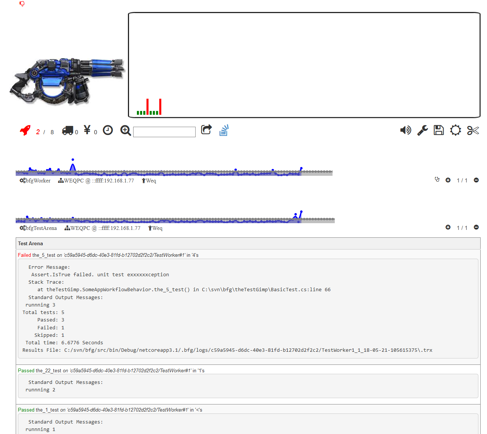

<div><h1>TheBFG

</h1>
</div> 

> A cloud-native `dotnet | .NET` *unit* / *integration* / *load* testing `tool` that *`clusters`* *automatically*

Feature | ...
-|-
`Zero-configuration` | <font size=2> the host will automatically detect listeners using the `SSDP` protocal (*but yes, you can provide config in multiple ways if required*)</font>
`Hyper-CD` | <font size=2>Verfy light-weight. Deploys apps in `ms`. Save time, and frustration, doing more testing, and less waiting or configuring.</font>
`Real-time reporting` | <font size=2>Use the `theBFG` [Test Arena](#the-testarena) to monitor in real-time all aspects of your tests including errors, worker CPU, MEM and throughput</font>
`NO DSL or JAVA or other` scripting to learn | <font size=2>Use all the same tools you love & pure `.net` to define complex intergation test scenarios</font>
`Continuous Fuzzy testing` |<font size=2> `theBFG` can execute your test suites in different ways, not just in different orders</font>
`Create worker clusters` with ease | <font size=2>Simply run `theBFG` on as many instances as you require!
`Target workers` with tags | <font size=2> Partition workers and route different tests conditionally with ease.
`Supercharge EXISTING test-suites` | <font size=2>theBGF supports distributing work to a cluster that will work together to execute it as quickly as possible</font>
`Cloud scale-out` | <font size=2>To really push the boundaries of your App, Cloud functions can be used to host workers</font>
`NO API bleed` | <font size=2>If you out-grow `theBFG` or otherwise dont require its sevices anymore, delete its reference, its config classes, the `.bfg` directory and **its gone**. *No refactor required.*</font>

> Checkout the [backlog](backlog.md) to see whats to come

# TheBFG *flow*

1. Code your `app`

2. Install `thebfg`
   
    ```
    dotnet tool install thebfg -g
    ```
    
3. Create a `unit-test`

and 

4. Configure your `IDE` to deploy your `unit-test` on compile:
``` 
AfterBuild: thebfg target {path/To/unit.test.dll} and fire and exit
```

or 

open up your *favourite* `console` and host a `Test Arena ` independently of any `IDE`

```
> thebfg target {path/To/unit.test.dll}
```

then `fire` in another process **or** any other *networked* host (*Win, Linux, macOS...*)
   
```
> thebfg fire
```

... and thats it. Each time you `compile` your `unit-test` will be deployed on demand the workers you have setup and they will run the tests in the way [you have commanded it](#quick-reference).

> **Pro Tips:**
> - use *wildcard* `*.tests.dll` to target all tests of specific patterns inside a folder, will search recursively
> - use `$` to target specific tests `...test.dll`$`any_test_you_want` inside a `.dll`
> - every command also works with `project files` as the `.dll` ie. `.csproj` `.fsproj` or `.vbproj`
> - `No after build triggers? No Worries!` theBFG also *`monitors the target for changes`*, automatically `reloading` and `fire`ing on *`every`* `update` to bring advanced Hyper-CD testing capabilities to **any** *`IDE`*

*<h2>Integration test?</h2>*

`thebfg target myTargets.bfc`

*myTagerts.bfc*
```
Target thisTest.dll, Target andThatTest.dll, Target atTheSameTime.dll
Target afterAllThoseCompleteSpawn3OfThese.dll;3
```

*<h2>Automation test? Start the SUT and monitor it for failures</h2>*

1. Configure your `IDE` to deploy the  `app-under-test` on compile:
   
`thebfg launch {app} {path/To/unit.test.dll} and exit`

7. Update your `test.dll` to download the App and get a reference to it

`nuget install thebfg`

```c#
// will install App into version folders nested -> app/target/dir/{version}/*.*
// will continuely monitor for fresh app updates and automatically update
// and launch it without having to restart your test - great for continuious
// stress testing or hyper CI/CD scenarios
var stop = theBFG.launch("app", "app/target/dir").Until(); 
```

....
repeat for as many `Apps` as your integration test depends on.


# Quick Reference

## Modes

By default, your tests will run in the same ordering and sequence as your `IDE`

To alter the execution mode of a test, simply end any launch command with a mode. Feel free to compose modes together to produce unique testing workflows for different situations.

Mode | Application
-|-
`Continious` | Runs a test on a loop over and over, logging any exceptions and restarting after any crash
  Options| **exitAfter**: *timespan* 
`Burst` | cluster will run test in loop modes at intervals that will ebb-and-flow over time
Options | **rampUp**: *timespan* \| **minBurst**: *timespan* \| **maxBurst**: *timespan*
`Compete` | makes the cluster work through an entire test-suite in a *first* **exit**, *first* **wins** scenario
Options | **batchSize**: *number* \| *reactive* <font size=1>(watches the consumption rate and auto-adjustes for fastest speed)</font>
`Rapid` | each test agent in the cluster will spawn a number of worker processes, and run the test on each thread. Combine this with `dotnet` thread multi-threading and to expose any bottlenecks in your architectureƒs
  Options| **runsInParallal**: *timespan* 
`Continious` | Runs a test on a loop over and over, logging any exceptions and restarting after any crash
  Options| **exitAfter**: *timespan*
`Using` | Runs a test using a specific test platform
  Options| **dotnet**: *uses dotnet test, for .NET core* **vstest**: *uses full framework vstest bundled with visual studio* \| **custom**: [use any test runner](#test-runners)

> **Pro tip:** use the bfgAPI to better control and *instead* feed a `IObservable<Timespan>` to any of these *options*!

# Tags

Each worker can be assigned `#one` `#or` `#more` `#tags`

*on a window machine:*
```
> thebfg fire #os:win
```

*on a macbook:*
```
> thebfg fire #os:macos
```

commands can then be `#tag`'ed

```
> thebfg launch some.dll #os:*
```

and `some.dll` will run ***on** **each** host* and *return* its results

or

```
> thebfg launch some.dll #os:win
```

to *only* run the test on the *windows* host

```
@ StartUnitTest some.dll #os:*
```

other logic ...

- If worker **is tagged**, and work **is tagged**, only matches will **run**
- If work **is tagged**, and **no** **matching** worker found, work will be **queued**
- If worker **is tagged**, and **work isn't**, work will be **run** on worker


## Commands

theBFG is truely a TDD multi-tool. It allows complex test scenarios to be orchestrated with its API accessible either via:
+ `>` the cmd line / terminal / bash
  
or

+ `@` thebfg command via *console* or *Test Arena*

or

+ `<PackageReference include="thebfg">` thebfg *dotnet* API & `theBfg.reloadWith(">cmd")`

* You can concat `commands and any params;together with;semi-colons` and they will run sequentially

### Unit or Integration Testing
* Run test arena and worker in same process
  
   ```
   > thebfg target test.dll and fire
   ```
  ```
  @ StartUnitTest test.dll
  ```  
* Stop a in-flight unit test on a specific worker

  ```
  Route: ...
  @ StopUnitTest
  ```  

* Re-run the last test suite whatever it was

  ```
  @ Reload
  ```

* Run Test Arena as a dedicated host that you can later send commands too either locally or remotely
  
  ```
  > thebfg launch
  ```

* TDD your heart out, discover all tests in every project in your checkout dir in seconds, later targeting 'em with a single click via the [Test Arena](#the-testarena)
  
  ```
  > thebfg launch reposRoot/*.tests.dll
  ```

* Send test to an existing Test Arena on `localhost`
  ```
  >thebfg target test.dll @localhost
  ```

* Exit theBFg after the target tests complete

```
> thebfg target test.dll and exit
```

## Debugging

remotely stream all logs from a worker for 10mins

```
Route: ...
@ StreamLogs 10
```

* All logs can then be seen in test arena console
  * via terminal
  * via [http://localhost:888/#/systemLog](http://localhost:888/#/systemLog) for tail
  * via [http://localhost:888/#/cmd](http://localhost:888/#/cmd) for real-time
## Cluster testing

* Setup a worker on any networked host and automatically join a Test Arena on another host

  ```
  > thebfg fire
  ```

  or

  ```
  > thebfg fire @host
  ```

* Make workers compete to execute test suite in parallel

  ```
  > thebfg launch test.dll and fire compete
  ```

  or fire multiple workers in process at the same time

  ```
  > thebfg launch test.dll and fire compete rapidly
  ```

### Integration Testing

* Create test execution plans that adhere to basic workflows with command files with using `TestExpression`

  ```
  thebfg target myTestWorkflow.bfc
  ```

* TestExpression components: `<bfgCmd>` `<params>` `[;,]` 

* Parallel test execution
  ```
  target some.dll,target another.dll
  ```

* Serial test execution
  ```
  target 1st.dll
  target 2nd.dll
  target 3rd.dll
  ```

* Target specific tests, 100 times
  ```
  target test.dll!a_specific_test;100
  ```

### Performance Testing

* Run a test worker for each CPU on the host
  
  ```
  > thebfg fire rapidly
  ```

  or go loco with 50 threads

  ```
  > thebfg fire rapidly 50
  ```

* Increase the amount of work a host will process in parallel

  ```
  @SpawnWorker
  ```

  or you can stop workers with

  ```
  @KillWorker
  ```

### Reliability Testing

* Run test suite over and over again repeadily, logging any failures
  ```
  > thebfg launch test.dll and fire continiously
  ```


### Data Save / Import / Export / Reset

* To save all data in a session

  ```
  > theBfg <anything> save
  ```

* To toggle saving data at any time
  
  ```
  @StartRecording
  ```

  or to stop it

  ```
  @StopRecording
  ```

* All data lives inside of the `.bfg` dir

  ```
  copy .bfg another/root/.bfg
  ```

  or

  ```
  cp .bfg another/root/.bfg
  ```

* Reset all data

  ```
  thebfg self destruct
  ```

  then 

  ```
  y
  ```

  or

* *no confirmation*, just do it
  
  ```
  thebfg self destruct quite
  ```

### Misc

* Run any command via `cmd.exe` or `/bin/bash`

  *ie. lookup networking info on worker*  

  *Windows*
  ```
  @ Run ipconfig /all
  ```

  *macOS*
  ```
  @ Run ifconfig
  ````

* *Disables* `web sockets`, uses `http` for all communication *between* Test Arena and its workers

  ```
  > thebfg <anything else> httponly
  ```

# Test Runners

Out of the box, theBFG works with `dotnet test` & `vstest.console.exe`. But in essence all it does it wrap the output streams, parsing and triggering different events along the way to feed the Test Arena. You can use this same technique, or a closer integration using theBFG API, to tune theBFG to your specific flow.

> More: Checkout the *Integration guide*

# The TestArena

TheBFG TestArena is a hyper-CD tool that allows you to understand whats going on *in realtime* through a web browser. It a minimal layer that is designed to supercharge TDD, while being pluggable into other systems / charts / CD pipelines as necessary.



It has features which are not listed here. Mouse over different parts of the UI to learn its functions and explore the system as it evolves...

## Features

### Real-time logs

Watch application output as it happens

Augment the stream with your own logging

`TestArena.Log.OnInfo/OnError/etc(msg)`


### Real-time metrics

Access Test Arena metrics and other bfg cluster vitals through a web-browser

 ... and you can add your own data points through the `bfgAPI`
 
### Automatic log shipping

* All workers will upload to the Test Arena during runs
  * Coverage results produced for all test `coverage.cobertura.xml`
  * `.Trx` files for inputs into other tools like [SonarCube](http://sonarcube.com)
  * Quick-links to all test assets via [TestArena](#the-testarena) portal
  * Ship your own assets by broadcasting `<UnitTestAssetResult>` *events*

### Monitor Errors

Any exception that is thrown in your test is surfaced through the portal


### Own your data

All data collected by the BFG will be placed in a `.bfg` folder next to where you executed the command.

Benifits include:
- Create different environments in different dirs to meet differing needs. 
- Move this folder around to move tests and metrics between hosts.
- Partially or completely check the folder into source control to share environments between team members.

### Real-time ports 

use [SignalR](http://dotnet.microsoft.com/) to subscribe to a real-time event feed using the `bfgAPI` to customise the integration for your specific  `use-case` ie. logging to [AppInsights](http://azure.microsoft.com/)


```
```

### Manage libraries of Apps

Each time a test is targeted, it is uploaded to the Test Arena so workers can later run the test. This repository can also be accessed via REST and allow you to distribute your tests through your infrastructure with ease.

[http://localhost:888/#/updates](http://localhost:888/#/updates)

Date| Changelog|comment
-|-|-
2/2/21 | 1.0.0-beta | Baseline API implemention
8/4/21 | 1.0.0 | Stable first release
8/4/21 | 1.0.1 | Adds auto detection of test runner
9/4/21 | 1.0.2 | House keeping
18/5/21 | 1.0.7 | New Features + Stabilising